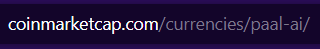
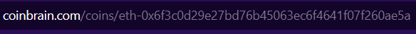

# Crypto P&L automatic

This project allows you to find out the value of one or more crypto tokens in real time with one or more purchase orders

Here you can see your profits/losses in dollars and as a percentage for a single buy order and for all the orders you've placed.


## Requirements

- Windows or Mac
- Excel
- Python (with pip)

## How to install

1. Download this project and extract it
2. Open a terminal

__Note__ :

- For Windows users, it is recommanded to use a UNIX bash (like [Cygwin](https://www.cygwin.com/)).
- For Mac, just open a new terminal

3. Install / Create a new virtual environement

- To install virtualenv : `pip install virtualenv`
- To create a new virtualenv : `virtualenv venv`

This allows you to create isolated Python environments to manage project-specific dependencies and packages, thus avoiding conflicts between different applications.

4. Activate the environment

- For Windows : `source venv/Script/activate`
- For Mac : `source venv/bin/activate`

5. Install the librairies

To install the librairies, just type this command :
- `pip install -r requirements.txt`

6. Set your data as you wish

In the file `data.json`, you can set the crypto you want to follow and indicate your buy price and quantity for one order
You can see in exemple here :

```
{
    "name":"PAAL AI",
    "hash":"paal-ai",
    "buy_price": [0.14, 0.16, 0.20],
    "quantity": [680, 600, 500]
},
```

Here, I have 3 orders for PAAL AI
For the hash, you need to set the value depending on how it appears on coinmarketcap or coinbrains
Let's see an instance :



Here, I pass the hash of PAAL AI into the url
The same thing apply for coinbrain :



If you need an another website, please let me know !

7. Launch the script

To launch the script, just type this command :
- `python main.py`

It will generate a Excel file called `Final.xlsx` into the project's folder and it will open it with the data you passed.
After this, it's gonna make the request to coinmarketcap or coinbrain to get current price of each token until you stop the script
It then calculates the P&L for each crypto you passed into the json file

8. Add/Update cryptos

If you want to add or update cryptos, you must do this in the JSON file directly and recreate a new Excel file
This command will help : `python main.py --regenerate`
It will recreate a new Excel file
